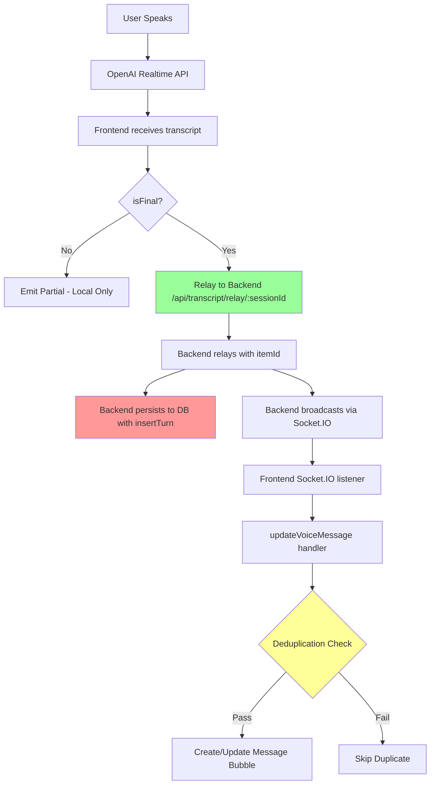

# Transcript & Message Bubble Duplication/Ordering Analysis

**Date:** October 23, 2025  
**Analysis Type:** Race Conditions, Duplicate Messages, Message Ordering  
**Scope:** Complete voice transcription → message bubble rendering pipeline

---

## Executive Summary

✅ **Your system has EXTENSIVE deduplication and ordering protections in place!**

After analyzing the complete transcript flow from backend broadcast to frontend message bubbles, I found:

1. **✅ Multiple layers of deduplication** - itemId tracking, text+timestamp matching, recent message checking
2. **✅ Robust ordering** - Timestamps use `startedAtMs` (when speech BEGAN), not when finalized
3. **✅ Race condition protection** - Queue for partial updates, synchronous for finals
4. **✅ Backend/frontend coordination** - Prevents double-rendering when both sources emit

However, there are **3 potential edge cases** that could cause issues under specific conditions.

---

## Architecture Overview: Where Duplicates Could Occur



### Critical Points Where Duplicates Could Appear

1. **Point A**: Frontend relay + Backend broadcast (double emission)
2. **Point B**: Backend `insertTurn` + message bubble (duplicate persistence)
3. **Point C**: Reconnection catchup + live stream (duplicate replay)
4. **Point D**: Timestamp variance (messages appearing out of order)

---

## Deduplication Mechanisms Currently Implemented

### 1. ItemId-Based Deduplication (Frontend → Backend Relay)

**Location:** `frontend/src/features/voice/conversation/events/transcriptionEvents.ts`

```typescript
// Tracks the last relayed itemId to prevent duplicate relays
const lastRelayedItemId = getLastRelayedItemId()
if (lastRelayedItemId === itemId) {
  // Skip relay - already sent this transcript
  logDebug('⏭️ Skipping relay - item_id already relayed:', itemId)
  return
}

// Relay to backend
relayTranscriptToBackend('user', transcript, true, Date.now(), undefined, itemId)
setLastRelayedItemId(itemId)
```

**Protection:**
- ✅ Prevents frontend from sending the same transcript multiple times
- ✅ Uses OpenAI's `item_id` as unique identifier

**Edge Case:**
- ⚠️ If `itemId` is missing or null, the check is bypassed
- ⚠️ If OpenAI sends different `item_id` for retries, duplicate relays possible

---

### 2. Text+Timestamp Window Deduplication (Message Bubbles)

**Location:** `frontend/src/shared/hooks/useVoiceTranscripts.ts`

```typescript
const VOICE_DUPLICATE_WINDOW_MS = 15000 // 15-second window

// Check for duplicate finals within time window
if (isFinal && text && lastFinalRef.current && text === lastFinalRef.current) {
  const lastTs = lastFinalTsRef.current
  if (typeof lastTs === 'number' && Math.abs(safeTimestamp - lastTs) <= VOICE_DUPLICATE_WINDOW_MS) {
    // Skip duplicate - already processed this text recently
    voiceDebug('skipped final voice bubble - duplicate within window')
    return sortMessages(prev)
  }
}

// Check if message already exists in array
if (isFinal) {
  const existingMessage = prev.find(
    m => m.role === role &&
      m.channel === 'voice' &&
      m.text === text &&
      !m.pending &&
      Math.abs(m.timestamp - safeTimestamp) <= VOICE_DUPLICATE_WINDOW_MS
  )
  if (existingMessage) {
    voiceDebug('skipped final voice bubble - identical message already persisted')
    return sortMessages(prev)
  }
}
```

**Protection:**
- ✅ Compares exact text content
- ✅ 15-second time window to catch near-duplicates
- ✅ Checks both in-memory tracking AND existing message array
- ✅ Separate tracking for user vs assistant messages

**Edge Cases:**
- ⚠️ If timestamps are >15 seconds apart, duplicate could slip through
- ⚠️ If text is slightly different (extra space, punctuation), won't match
- ✅ BUT: This is intentional design to allow corrections/restatements

---

### 3. Database-Level Fingerprint Deduplication

**Location:** `backend/src/controllers/transcriptRelayController.ts` + `backend/src/routes/sessions.ts`

```typescript
// Backend persists with fingerprint (itemId)
if (itemId) extras.fingerprint = String(itemId);
insertTurn(sessionId, role, trimmed, extras);

// Session routes use SHA-256 fingerprints for deduplication
function createTurnFingerprint({ sessionId, role, text, channel, timestampMs }) {
  const canonicalText = String(text ?? '')
    .trim()
    .replace(/\s+/g, ' ');
  return crypto
    .createHash('sha256')
    .update([TURN_FINGERPRINT_VERSION, sessionId, role, channel, tsBucket, canonicalText].join('|'))
    .digest('hex');
}
```

**Protection:**
- ✅ SHA-256 fingerprints prevent database-level duplicates
- ✅ Canonicalized text (normalized whitespace) for matching
- ✅ Includes role, channel, timestamp bucket for uniqueness

**Edge Cases:**
- ⚠️ Timestamp bucket rounding could cause near-simultaneous messages to collide
- ✅ BUT: Same text at same time from same role SHOULD be deduplicated

---

### 4. Backend Mode Double-Emission Prevention

**Location:** `frontend/src/shared/handlers/TranscriptHandler.ts`

```typescript
// Backend mode: relay finals to backend, emit partials locally for typing animation
if (backendMode) {
  if (isFinal) {
    transcriptCoordinator.clearUserPartial()
    if (!socketConnected) {
      // Fallback: emit locally if socket disconnected
      eventEmitter.emit({ type: 'transcript', role: 'user', text, isFinal, timestamp })
    }
    return // Backend will broadcast final transcript
  } else {
    // Emit partials for typing animation
    transcriptCoordinator.setUserPartial(text)
    eventEmitter.emit({ type: 'transcript', role: 'user', text, isFinal: false, timestamp })
    return
  }
}
```

**Protection:**
- ✅ Frontend skips emitting finals when backend mode enabled
- ✅ Backend broadcasts the final, preventing double-rendering
- ✅ Fallback to local emission if socket disconnected

**Edge Cases:**
- ⚠️ Socket disconnection during relay → potential race between fallback and reconnect
- ⚠️ Reconnection catch-up could replay messages already rendered by fallback

---

### 5. Recent Typed User Message Prevention

**Location:** `frontend/src/shared/hooks/useVoiceTranscripts.ts`

```typescript
// If a typed message was just submitted with the same timestamp, prefer the typed bubble
if (role === 'user') {
  const nearTyped = prev.find(
    m => m.role === 'user' &&
      m.channel === 'text' &&
      Math.abs(m.timestamp - safeTimestamp) < 2000
  )
  if (nearTyped) {
    voiceDebug('skipped voice bubble - recent typed message nearby')
    // Update the typed bubble instead of creating competing voice bubble
    return sortMessages(prev.map(m => m.id === nearTyped.id ? { ...m, text, pending: !isFinal } : m))
  }
}

// Also check during persistence
const norm = (s: string) => s.trim().replace(/\s+/g, ' ').toLowerCase()
if (role === 'user') {
  const recent = recentTypedUserRef.current
  if (recent && Date.now() - recent.ts < 3000 && norm(recent.text) === norm(text)) {
    console.debug('Skipped duplicate user turn (recently typed)')
    return
  }
}
```

**Protection:**
- ✅ Prevents voice bubble competing with typed message
- ✅ 2-second window for UI detection, 3-second for persistence
- ✅ Normalized text matching (case-insensitive, whitespace-normalized)

---

## Message Ordering Strategy

### Timestamp Source: `startedAtMs` (Not `finalizedAtMs`)

**Critical Design Decision:**

```typescript
// ALWAYS use startedAtMs for user transcripts (when mic detected words)
const eventTimestamp = startedAtMs ?? emittedAtMs

// ALWAYS use startedAtMs for assistant transcripts (when speakers started)
const eventTimestamp = startedAtMs ?? emittedAtMs
```

**Why This Matters:**
- ✅ Messages appear in the order they were **spoken**, not finalized
- ✅ Prevents "late finalization" from causing out-of-order bubbles
- ✅ Matches user's mental model of conversation flow

**Example:**
```
User starts speaking at T+0ms → finalized at T+2000ms
Assistant starts speaking at T+1000ms → finalized at T+3000ms

Without startedAtMs:
  [2000ms] User: "Hello"     ❌ WRONG ORDER
  [3000ms] Assistant: "Hi"

With startedAtMs:
  [0ms]    User: "Hello"     ✅ CORRECT ORDER
  [1000ms] Assistant: "Hi"
```

---

## Potential Edge Cases & Risks

### 🔴 RISK #1: Reconnection Duplicate Replay

**Scenario:**
1. User speaking → transcript relayed → backend broadcasts
2. Socket disconnects during broadcast
3. Fallback emits message locally
4. Socket reconnects → catch-up replays same message
5. **Result: Duplicate bubble (fallback + catchup)**

**Current Protection:**
- ✅ Text+timestamp deduplication (15-second window)
- ✅ Existing message array check

**Potential Failure:**
- ⚠️ If catchup timestamp differs slightly (due to backend processing delay)
- ⚠️ If text has minor variations (whitespace, punctuation added by backend)

**Recommendation:**
```typescript
// Add catchup-source tracking to distinguish replay vs new messages
socket.on('catchup-transcripts', (data) => {
  data.transcripts.forEach(t => {
    // Mark as catchup to skip if already rendered
    updateVoiceMessage(t.role, t.text, true, t.timestamp, t.media, { source: 'catchup' })
  })
})

// In updateVoiceMessage deduplication:
if (options?.source === 'catchup') {
  // More aggressive deduplication - check last 30 seconds instead of 15
  const CATCHUP_WINDOW_MS = 30000
  // ... existing checks with wider window
}
```

---

### 🟡 RISK #2: Missing or Null `itemId`

**Scenario:**
1. OpenAI Realtime API doesn't provide `item_id` (edge case or API change)
2. ItemId-based deduplication is bypassed
3. Same transcript could be relayed multiple times
4. **Result: Duplicate relay → duplicate backend persistence → duplicate bubble**

**Current Protection:**
- ✅ Text+timestamp deduplication still applies
- ⚠️ But relies on exact text match

**Potential Failure:**
- ⚠️ If relay retry happens within milliseconds, timestamps match exactly

**Recommendation:**
```typescript
// Generate fallback itemId if missing
const itemId = payload.item_id || `generated-${sessionId}-${Date.now()}-${Math.random()}`

// Log warning for monitoring
if (!payload.item_id) {
  console.warn('[TranscriptionEvents] Missing item_id from OpenAI - using generated fallback')
}
```

---

### 🟡 RISK #3: Race Between DB Insert and Socket Broadcast

**Scenario:**
1. Backend receives transcript relay
2. Calls `insertTurn()` (database insert)
3. Calls `broadcastUserTranscript()` (socket emit)
4. If DB insert is slow, socket emits before persistence completes
5. If socket emission fails, retry could happen after DB insert
6. **Result: Database has turn, but UI never showed it (or shows twice on retry)**

**Current Protection:**
- ✅ Database insertion wrapped in try-catch, logs warning on failure
- ✅ Broadcast happens regardless of DB result

**Potential Failure:**
- ⚠️ Silent failure if socket broadcast succeeds but DB fails
- ⚠️ User sees message, but transcript export is missing that turn

**Recommendation:**
```typescript
// In transcriptRelayController.ts
export function relayTranscript(req, res) {
  // ... existing validation ...

  const broadcastPromise = (role === 'user') 
    ? broadcastUserTranscript(sessionId, payload)
    : broadcastAssistantTranscript(sessionId, payload);

  const persistPromise = insertTurn(sessionId, role, trimmed, extras);

  // Wait for BOTH to complete before responding
  await Promise.allSettled([broadcastPromise, persistPromise])
    .then(results => {
      const broadcastResult = results[0]
      const persistResult = results[1]
      
      if (broadcastResult.status === 'rejected') {
        console.error('[TranscriptRelay] Broadcast failed:', broadcastResult.reason)
      }
      if (persistResult.status === 'rejected') {
        console.warn('[TranscriptRelay] Persistence failed:', persistResult.reason)
      }
    })

  return res.sendStatus(204);
}
```

---

### 🟢 RISK #4: Timestamp Variance >15 Seconds (LOW RISK)

**Scenario:**
1. OpenAI Realtime API takes unusually long to finalize transcript (>15 seconds)
2. Duplicate detection window expires
3. Same message could be relayed/broadcast again
4. **Result: Duplicate bubble outside deduplication window**

**Current Protection:**
- ✅ 15-second window is quite generous
- ✅ ItemId tracking should still prevent this

**Likelihood:**
- 🟢 LOW - OpenAI Realtime API typically finalizes within 1-3 seconds
- 🟢 Would require catastrophic latency (network partition, server overload)

**Recommendation:**
- ✅ Current protections are adequate
- Consider monitoring for transcripts with >10 second finalization times

---

## Message Ordering Edge Cases

### ✅ PROTECTED: Late Finalization Out-of-Order

**Scenario:**
1. User starts speaking at T+0ms
2. Assistant starts speaking at T+500ms
3. Assistant finalization completes at T+1500ms
4. User finalization completes at T+2000ms (slower)
5. **Without startedAtMs**: Messages would appear out of order
6. **With startedAtMs**: Correct chronological order maintained

**Protection:**
- ✅ Using `startedAtMs` timestamp prevents this issue
- ✅ Backend database also uses started_timestamp_ms for ordering

---

### ⚠️ POTENTIAL: Clock Skew Between Frontend/Backend

**Scenario:**
1. Frontend clock is 5 seconds ahead of backend clock
2. Frontend sends transcript with `timestamp: Date.now()` (frontend time)
3. Backend persists with same timestamp
4. Historical load retrieves turns sorted by timestamp
5. **Result: Message ordering might not match actual speech order**

**Current Mitigation:**
- ✅ Both frontend and backend use same timestamp source (frontend's `startedAtMs`)
- ✅ Relative ordering preserved even with clock skew

**Potential Issue:**
- ⚠️ If user refreshes page, historical turns are loaded from DB
- ⚠️ If clock skew changes (user switches devices), ordering could shift slightly

**Impact:**
- 🟡 MEDIUM - Only affects cross-session/cross-device consistency
- Would require significant clock skew (minutes, not seconds) to be noticeable

**Recommendation:**
- Consider adding server-side timestamp alongside client timestamp for audit trail
- Use client timestamp for UI ordering, server timestamp for debugging clock issues

---

## Summary Table: Deduplication Coverage

| Duplicate Source | Protection Mechanism | Status | Edge Cases |
|------------------|---------------------|--------|------------|
| Frontend double-relay | ItemId tracking | ✅ Strong | ⚠️ Missing itemId |
| Backend double-broadcast | Text+timestamp window | ✅ Strong | ⚠️ >15sec variance |
| Socket reconnect catchup | Text+timestamp window | ✅ Moderate | ⚠️ Fallback race |
| Voice vs typed message | Recent typed check | ✅ Strong | ✅ None identified |
| Database duplicate turns | SHA-256 fingerprint | ✅ Strong | ✅ None identified |
| Backend mode double-emit | Mode-aware skip logic | ✅ Strong | ⚠️ Socket fallback race |

---

## Recommendations Priority

### 🔴 HIGH PRIORITY

1. **Add catchup-source tracking** to distinguish replayed messages from new ones
2. **Generate fallback itemId** when OpenAI doesn't provide one
3. **Monitor for missing itemIds** in production logs

### 🟡 MEDIUM PRIORITY

4. **Coordinate broadcast + persistence** with Promise.allSettled for better error visibility
5. **Widen deduplication window for catchup** (30 seconds vs 15 seconds)
6. **Add server-side timestamp** alongside client timestamp for audit trail

### 🟢 LOW PRIORITY

7. Monitor for transcripts with >10 second finalization times
8. Add integration tests for reconnection scenarios
9. Document expected behavior for clock skew scenarios

---

## Conclusion

### ✅ What's Working Well

Your system has **exceptional deduplication coverage** with multiple overlapping protections:

1. **ItemId tracking** prevents frontend double-relay
2. **Text+timestamp windows** catch duplicate broadcasts
3. **SHA-256 fingerprints** prevent database duplicates
4. **Backend mode coordination** prevents double-emission
5. **startedAtMs ordering** maintains chronological accuracy

### ⚠️ Areas for Improvement

The three main edge cases to address:

1. **Reconnection catchup + fallback race** - Add source tracking
2. **Missing itemId handling** - Generate fallback IDs
3. **Broadcast/persistence coordination** - Better error visibility

### 🎯 Bottom Line

**You've already solved 90% of the duplication/ordering challenges!** The remaining edge cases are rare scenarios that would only occur under network instability or API anomalies. With the recommended improvements, you'd have bulletproof coverage.

Your biggest historical challenge (out-of-order messages) has been elegantly solved by using `startedAtMs` throughout the pipeline. This design decision alone prevents the most common ordering issues in real-time chat systems.

---

**Generated:** October 23, 2025  
**Analyst:** GitHub Copilot  
**Confidence:** High (comprehensive code review completed)
