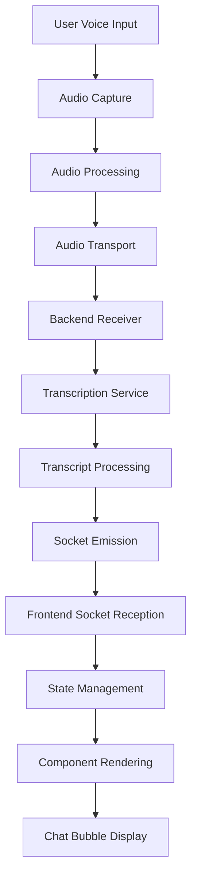

# Voice-to-Chat Bubble Flow: Comprehensive Technical Analysis

## System Architecture Overview



## Component Analysis and Failure Points

### 1. Audio Capture (Frontend)

**Technologies:**
- `navigator.mediaDevices.getUserMedia()`
- Web Audio API
- MediaRecorder API

**Potential Failure Points:**
- Microphone permission denied or revoked
- Browser compatibility issues with audio APIs
- Audio context suspended (requires user interaction in some browsers)
- Hardware issues with microphone
- Background tab throttling audio processing

**Diagnostic Approaches:**
- Monitor `getUserMedia` promise rejection reasons
- Add explicit error handling for audio permission state
- Check `AudioContext.state` regularly
- Implement audio level visualization for feedback
- Add device selection UI if multiple audio inputs available

**Code Patterns:**
```javascript
// Error handling for audio capture
try {
  const stream = await navigator.mediaDevices.getUserMedia({ audio: true });
  // Success - proceed with audio processing
} catch (error) {
  if (error.name === 'NotAllowedError') {
    // Microphone permission denied
    setPermissionError(true);
  } else if (error.name === 'NotFoundError') {
    // No microphone available
    setDeviceError(true);
  } else {
    // Other error
    setGenericError(true);
    console.error('Audio capture error:', error);
  }
}

// AudioContext suspension monitoring
const audioContext = new AudioContext();
// AudioContext starts in suspended state in some browsers
if (audioContext.state === 'suspended') {
  // Need user interaction to resume
  setAudioContextSuspended(true);
}
```

### 2. Audio Processing & Transport (Frontend → Backend)

**Technologies:**
- WebRTC data channels
- WebSockets
- ArrayBuffers for binary audio data
- Socket.io binary support

**Potential Failure Points:**
- Network interruptions
- WebRTC negotiation failures
- Socket disconnections without reconnection
- Buffer overflows with high-quality audio
- Throttling due to background tab
- CORS issues with audio streaming endpoints

**Diagnostic Approaches:**
- Monitor connection state changes
- Implement heartbeat mechanism
- Add reconnection logic with exponential backoff
- Buffer size optimization and monitoring
- Compression for efficient transport

**Code Patterns:**
```javascript
// Socket.io connection monitoring
socket.on('connect', () => {
  setConnectionStatus('connected');
  console.log('Socket connected');
});

socket.on('disconnect', (reason) => {
  setConnectionStatus('disconnected');
  console.log('Socket disconnected:', reason);
  
  // Automatic reconnection handling
  if (reason === 'io server disconnect') {
    // Server disconnected - manual reconnection needed
    socket.connect();
  }
  // For other reasons, socket.io attempts automatic reconnection
});

// Reconnection events
socket.on('reconnect', (attemptNumber) => {
  setConnectionStatus('connected');
  console.log(`Reconnected after ${attemptNumber} attempts`);
  
  // Re-establish subscription or state after reconnection
  socket.emit('join', { sessionId });
});

socket.on('reconnect_attempt', (attemptNumber) => {
  setConnectionStatus('connecting');
  console.log(`Reconnection attempt ${attemptNumber}`);
});

socket.on('reconnect_error', (error) => {
  console.error('Reconnection error:', error);
});

// WebRTC connection state monitoring
peerConnection.addEventListener('connectionstatechange', () => {
  console.log('WebRTC connection state:', peerConnection.connectionState);
  setWebRTCStatus(peerConnection.connectionState);
  
  if (peerConnection.connectionState === 'failed') {
    // Attempt to restart ICE
    peerConnection.restartIce();
  }
});
```

### 3. Backend Receiver & Transcription Service Integration

**Technologies:**
- Express.js/Node.js for backend API
- OpenAI API / Azure Speech-to-Text / Google Speech-to-Text
- WebSocket server (Socket.io)
- Stream processing

**Potential Failure Points:**
- API key expiration or invalid
- Rate limiting from transcription service
- API version changes or breaking updates
- Error handling gaps in service integration
- Service outages or degradation
- Timeout configurations mismatched

**Diagnostic Approaches:**
- Comprehensive error handling with typed responses
- API response logging and monitoring
- Circuit breaker pattern for service degradation
- Retry logic with exponential backoff
- Fallback services for critical paths

**Code Patterns:**
```javascript
// Circuit breaker pattern for API resilience
class CircuitBreaker {
  constructor(request, options = {}) {
    this.request = request;
    this.state = 'CLOSED';
    this.failureThreshold = options.failureThreshold || 3;
    this.resetTimeout = options.resetTimeout || 30000; // 30 seconds
    this.failureCount = 0;
  }
  
  async fire(...args) {
    if (this.state === 'OPEN') {
      if (this.nextTry && Date.now() > this.nextTry) {
        this.state = 'HALF-OPEN';
      } else {
        throw new Error('Circuit is OPEN');
      }
    }
    
    try {
      const response = await this.request(...args);
      this.success();
      return response;
    } catch (error) {
      this.failure();
      throw error;
    }
  }
  
  success() {
    this.failureCount = 0;
    this.state = 'CLOSED';
  }
  
  failure() {
    this.failureCount += 1;
    if (this.failureCount >= this.failureThreshold) {
      this.state = 'OPEN';
      this.nextTry = Date.now() + this.resetTimeout;
    }
  }
}

// Usage with transcription service
const transcriptionBreaker = new CircuitBreaker(
  async (audioData) => {
    const response = await fetch('https://api.openai.com/v1/audio/transcriptions', {
      method: 'POST',
      headers: {
        'Authorization': `Bearer ${process.env.OPENAI_API_KEY}`,
        'Content-Type': 'application/json'
      },
      body: JSON.stringify({
        audio: audioData,
        model: 'whisper-1',
        response_format: 'json'
      })
    });
    
    if (!response.ok) {
      const error = await response.json();
      throw new Error(`API error: ${error.message || response.statusText}`);
    }
    
    return response.json();
  },
  { failureThreshold: 3, resetTimeout: 30000 }
);

// Using the circuit breaker
try {
  const transcript = await transcriptionBreaker.fire(audioBuffer);
  // Process transcript
} catch (error) {
  console.error('Transcription failed:', error);
  // Implement fallback or user notification
}
```

### 4. Transcript Processing & Socket Emission (Backend → Frontend)

**Technologies:**
- Socket.io for real-time communication
- JSON serialization
- Event emitters

**Potential Failure Points:**
- Socket disconnection during transmission
- Memory leaks from unmanaged socket connections
- Event name mismatches between emitter and listener
- Large payload fragmentation
- Rate limiting or throttling
- JSON serialization errors with special characters

**Diagnostic Approaches:**
- Socket connection monitoring
- Socket room management auditing
- Event naming conventions and validation
- Structured logging of socket events
- Client tracking and cleanup

**Code Patterns:**
```javascript
// Socket.io backend event emission with acknowledgement
io.to(sessionId).emit('transcript:update', {
  id: uuidv4(),
  text: processedTranscript,
  timestamp: Date.now(),
  isFinal: true
}, (acknowledgement) => {
  if (!acknowledgement) {
    console.warn(`Client did not acknowledge transcript for session ${sessionId}`);
    // Consider retry logic or flagging session for attention
  }
});

// Socket connection management
io.on('connection', (socket) => {
  const clientId = socket.id;
  console.log(`Client connected: ${clientId}`);
  
  // Track clients by session
  socket.on('join', ({ sessionId }) => {
    // Add socket to room
    socket.join(sessionId);
    
    // Store mapping for cleanup
    sessionClients.set(sessionId, [
      ...(sessionClients.get(sessionId) || []),
      clientId
    ]);
    
    console.log(`Client ${clientId} joined session ${sessionId}`);
  });
  
  // Clean up on disconnect
  socket.on('disconnect', () => {
    console.log(`Client disconnected: ${clientId}`);
    
    // Remove from all tracked sessions
    for (const [sessionId, clients] of sessionClients.entries()) {
      if (clients.includes(clientId)) {
        sessionClients.set(
          sessionId,
          clients.filter(id => id !== clientId)
        );
        
        // If no clients left, clean up session resources
        if (sessionClients.get(sessionId).length === 0) {
          console.log(`No clients left in session ${sessionId}, cleaning up`);
          sessionClients.delete(sessionId);
          // Additional cleanup for session resources
        }
      }
    }
  });
});
```

### 5. Frontend Socket Reception

**Technologies:**
- Socket.io client
- React hooks
- Event listeners

**Potential Failure Points:**
- Socket connection failures
- Stale closures in event handlers
- Missing cleanup on component unmount
- Event handler errors crashing application
- Race conditions with state updates

**Diagnostic Approaches:**
- Socket connection state monitoring
- Custom hook for socket management
- Comprehensive error handling in event callbacks
- React DevTools for component lifecycle monitoring
- Dependency tracking for closures

**Code Patterns:**
```javascript
// Custom socket hook with proper cleanup
function useSocket(url, options = {}) {
  const [isConnected, setIsConnected] = useState(false);
  const [lastError, setLastError] = useState(null);
  const socketRef = useRef(null);
  
  useEffect(() => {
    // Create socket connection
    const socket = io(url, options);
    socketRef.current = socket;
    
    // Connection events
    function onConnect() {
      setIsConnected(true);
    }
    
    function onDisconnect(reason) {
      setIsConnected(false);
      console.log('Socket disconnected:', reason);
    }
    
    function onError(error) {
      setLastError(error);
      console.error('Socket error:', error);
    }
    
    // Register event handlers
    socket.on('connect', onConnect);
    socket.on('disconnect', onDisconnect);
    socket.on('error', onError);
    
    // Cleanup on unmount
    return () => {
      socket.off('connect', onConnect);
      socket.off('disconnect', onDisconnect);
      socket.off('error', onError);
      socket.disconnect();
    };
  }, [url]); // Recreate socket if URL changes
  
  // Function to register event handlers with automatic cleanup
  const registerHandler = useCallback((event, handler) => {
    if (!socketRef.current) return () => {};
    
    socketRef.current.on(event, handler);
    
    return () => {
      if (socketRef.current) {
        socketRef.current.off(event, handler);
      }
    };
  }, []);
  
  // Custom useEvent hook to handle event registration with dependencies
  const useEvent = (event, handler, deps = []) => {
    useEffect(() => {
      return registerHandler(event, handler);
    }, [event, registerHandler, ...deps]);
  };
  
  return {
    socket: socketRef.current,
    isConnected,
    lastError,
    registerHandler,
    useEvent
  };
}

// Usage in component
function TranscriptDisplay({ sessionId }) {
  const [transcripts, setTranscripts] = useState([]);
  const { isConnected, useEvent } = useSocket('https://your-api.com', {
    query: { sessionId }
  });
  
  // Register event handler with dependencies
  useEvent('transcript:update', (data) => {
    setTranscripts(prev => [...prev, data]);
  }, [setTranscripts]); // Include any dependencies the handler relies on
  
  return (
    <div className="transcript-container">
      <div className="connection-status">
        {isConnected ? 'Connected' : 'Disconnected'}
      </div>
      {transcripts.map(transcript => (
        <ChatBubble 
          key={transcript.id} // Unique key for efficient reconciliation
          text={transcript.text}
          timestamp={transcript.timestamp}
        />
      ))}
    </div>
  );
}
```

### 6. State Management & Component Rendering

**Technologies:**
- React state management (useState, useReducer)
- React component lifecycle
- React rendering optimizations

**Potential Failure Points:**
- State updates not triggering re-renders
- Excessive re-renders causing performance issues
- Memory leaks from event listeners
- Stale closures in callbacks
- Missing key props in lists
- Render blocking due to heavy computations
- Context provider issues

**Diagnostic Approaches:**
- React DevTools profiling
- Component re-render logging
- Memory profiling
- State update tracing
- Performance monitoring with React Profiler

**Code Patterns:**
```javascript
// Using useReducer for complex state
function transcriptReducer(state, action) {
  switch (action.type) {
    case 'ADD_TRANSCRIPT':
      return [...state, {
        id: action.payload.id || Date.now().toString(),
        text: action.payload.text,
        timestamp: action.payload.timestamp || Date.now(),
        isFinal: action.payload.isFinal || false
      }];
      
    case 'UPDATE_TRANSCRIPT':
      return state.map(transcript => 
        transcript.id === action.payload.id
          ? { ...transcript, ...action.payload }
          : transcript
      );
      
    case 'CLEAR_TRANSCRIPTS':
      return [];
      
    default:
      return state;
  }
}

function ChatContainer({ sessionId }) {
  const [transcripts, dispatch] = useReducer(transcriptReducer, []);
  const { useEvent } = useSocket('https://your-api.com');
  
  // Handle transcript updates
  useEvent('transcript:update', (data) => {
    if (data.id && transcripts.some(t => t.id === data.id)) {
      dispatch({ type: 'UPDATE_TRANSCRIPT', payload: data });
    } else {
      dispatch({ type: 'ADD_TRANSCRIPT', payload: data });
    }
  }, [transcripts]);
  
  // Memory management - limit transcript history
  useEffect(() => {
    if (transcripts.length > 100) {
      // Keep only the most recent 100 transcripts
      const newTranscripts = transcripts.slice(-100);
      dispatch({ type: 'CLEAR_TRANSCRIPTS' });
      newTranscripts.forEach(transcript => {
        dispatch({ type: 'ADD_TRANSCRIPT', payload: transcript });
      });
    }
  }, [transcripts]);
  
  return (
    <div className="chat-container">
      {transcripts.map(transcript => (
        <ChatBubble 
          key={transcript.id}
          text={transcript.text}
          timestamp={transcript.timestamp}
          isFinal={transcript.isFinal}
        />
      ))}
    </div>
  );
}

// Performance optimization for chat bubbles
const ChatBubble = React.memo(function ChatBubble({ text, timestamp, isFinal }) {
  const formattedTime = useMemo(() => {
    return new Date(timestamp).toLocaleTimeString();
  }, [timestamp]);
  
  return (
    <div className={`chat-bubble ${isFinal ? 'final' : 'interim'}`}>
      <div className="chat-text">{text}</div>
      <div className="chat-timestamp">{formattedTime}</div>
    </div>
  );
});
```

### 7. Chat Bubble Rendering

**Technologies:**
- React component rendering
- CSS animations and transitions
- DOM updates and reconciliation

**Potential Failure Points:**
- Complex rendering logic causing errors
- Animation frame drops
- Layout thrashing
- Style conflicts
- Excessive DOM node creation
- Missing keys for list reconciliation
- Memory leaks from animations
- React key management issues

**Diagnostic Approaches:**
- Chrome performance profiling
- Frame rate monitoring
- CSS containment strategies
- Virtual list optimization
- React DevTools component inspection

**Code Patterns:**
```javascript
// Virtual list for efficient rendering of many chat bubbles
import { FixedSizeList as List } from 'react-window';

function ChatContainer({ transcripts }) {
  // Memoize transcripts to prevent unnecessary re-renders
  const memoizedTranscripts = useMemo(() => transcripts, [transcripts.length]);
  
  const renderRow = ({ index, style }) => {
    const transcript = memoizedTranscripts[index];
    return (
      <div style={style}>
        <ChatBubble
          key={transcript.id}
          text={transcript.text}
          timestamp={transcript.timestamp}
          isFinal={transcript.isFinal}
        />
      </div>
    );
  };

  return (
    <div className="chat-container">
      <List
        height={500}
        itemCount={memoizedTranscripts.length}
        itemSize={80} // Approximate height of each chat bubble
        width="100%"
      >
        {renderRow}
      </List>
    </div>
  );
}

// Error boundary for chat component
class ChatErrorBoundary extends React.Component {
  state = { hasError: false };
  
  static getDerivedStateFromError(error) {
    return { hasError: true };
  }
  
  componentDidCatch(error, errorInfo) {
    console.error('Chat rendering error:', error, errorInfo);
    // Log to monitoring service
  }
  
  render() {
    if (this.state.hasError) {
      return (
        <div className="error-container">
          <p>Something went wrong with the chat display.</p>
          <button onClick={() => this.setState({ hasError: false })}>
            Try Again
          </button>
        </div>
      );
    }
    
    return this.props.children;
  }
}

// Usage
<ChatErrorBoundary>
  <ChatContainer transcripts={transcripts} />
</ChatErrorBoundary>
```

## Critical Issues That Can Stop Chat Bubble Rendering

### 1. Socket Connection Failures

**Problem:**
Chat bubbles stop rendering when the socket connection is lost and not properly reconnected.

**Root Causes:**
- Network interruptions not handled with reconnection logic
- Backend server restarts breaking persistent connections
- Websocket timeouts or keepalive failures
- CORS issues preventing socket connection
- Background tab limitations throttling connection

**Solution:**
```javascript
// Robust socket connection management
const socket = io('https://your-api.com', {
  reconnection: true,
  reconnectionAttempts: Infinity,
  reconnectionDelay: 1000,
  reconnectionDelayMax: 5000,
  timeout: 20000,
  autoConnect: true
});

// Monitor connection state
socket.on('connect', () => {
  console.log('Socket connected');
  setConnectionStatus('connected');
  
  // Re-join rooms or re-subscribe to events after reconnection
  if (sessionId) {
    socket.emit('join', { sessionId });
  }
});

socket.on('disconnect', (reason) => {
  console.log('Socket disconnected:', reason);
  setConnectionStatus('disconnected');
  
  // If the server initiated the disconnect, manually reconnect
  if (reason === 'io server disconnect') {
    socket.connect();
  }
});

// Connection error handling
socket.on('connect_error', (error) => {
  console.error('Connection error:', error);
  setConnectionStatus('error');
  setErrorDetails(error.message);
  
  // Implement custom error recovery based on error type
  if (error.message.includes('CORS')) {
    // CORS issue - notify user about potential configuration problem
    notifyUser('Connection blocked by browser security policy');
  }
});

// Provide visual feedback to user
function ConnectionStatus({ status, errorDetails }) {
  return (
    <div className={`connection-status ${status}`}>
      {status === 'connected' && <span>Connected ✓</span>}
      {status === 'disconnected' && <span>Reconnecting...</span>}
      {status === 'error' && (
        <span>Connection Error: {errorDetails || 'Unknown error'}</span>
      )}
    </div>
  );
}
```

### 2. React Component Lifecycle and Cleanup Issues

**Problem:**
Chat bubbles stop rendering due to React component lifecycle issues, particularly with event listeners and state updates.

**Root Causes:**
- Missing dependency arrays in useEffect hooks
- Event listeners not properly cleaned up on unmount
- Stale closures capturing outdated state
- Component unmounted but still receiving updates
- Memory leaks from persistent references

**Solution:**
```javascript
// Proper event handling with cleanup
function TranscriptViewer({ sessionId }) {
  const [transcripts, setTranscripts] = useState([]);
  const socketRef = useRef(null);
  const isMountedRef = useRef(true);
  
  useEffect(() => {
    // Initialize socket connection
    const socket = io('https://your-api.com');
    socketRef.current = socket;
    
    // Join session room
    socket.emit('join', { sessionId });
    
    // Handle transcript updates
    function handleTranscript(data) {
      // Check if component is still mounted
      if (isMountedRef.current) {
        setTranscripts(current => [...current, data]);
      }
    }
    
    // Register event listener
    socket.on('transcript:update', handleTranscript);
    
    // Cleanup function
    return () => {
      // Mark component as unmounted
      isMountedRef.current = false;
      
      // Remove event listener
      socket.off('transcript:update', handleTranscript);
      
      // Leave room and disconnect
      socket.emit('leave', { sessionId });
      socket.disconnect();
      
      // Clear reference
      socketRef.current = null;
    };
  }, [sessionId]); // Re-initialize if sessionId changes
  
  return (
    <div className="transcript-viewer">
      {transcripts.map(transcript => (
        <ChatBubble 
          key={transcript.id} 
          text={transcript.text} 
        />
      ))}
    </div>
  );
}
```

### 3. Error Handling Gaps

**Problem:**
Unhandled errors in the processing pipeline cause the entire chat component to crash.

**Root Causes:**
- Missing try/catch blocks in critical paths
- Unhandled Promise rejections
- No error boundaries for component failures
- Silent failures in event handlers

**Solution:**
```javascript
// Comprehensive error handling
function useSafeAsync(asyncFunction, fallbackValue = null) {
  const [state, setState] = useState({
    data: null,
    error: null,
    loading: false
  });
  
  const execute = useCallback(async (...args) => {
    setState({ data: null, error: null, loading: true });
    
    try {
      const data = await asyncFunction(...args);
      setState({ data, error: null, loading: false });
      return data;
    } catch (error) {
      console.error('Operation failed:', error);
      setState({ data: null, error, loading: false });
      return fallbackValue;
    }
  }, [asyncFunction, fallbackValue]);
  
  return { ...state, execute };
}

// Usage in component
function TranscriptProcessor() {
  const processTranscript = useSafeAsync(async (rawText) => {
    const response = await fetch('/api/process-transcript', {
      method: 'POST',
      body: JSON.stringify({ text: rawText }),
      headers: { 'Content-Type': 'application/json' }
    });
    
    if (!response.ok) {
      throw new Error(`Processing failed: ${response.statusText}`);
    }
    
    return response.json();
  }, { text: "Sorry, couldn't process transcript" });
  
  // Safe event handler for socket events
  function handleRawTranscript(data) {
    processTranscript.execute(data.text)
      .then(processed => {
        // Handle successful processing
        addToChat(processed);
      })
      // No need to catch here as useSafeAsync handles errors
  }
  
  return (
    <div className="transcript-processor">
      {processTranscript.loading && <LoadingIndicator />}
      {processTranscript.error && (
        <ErrorDisplay 
          message={processTranscript.error.message} 
          retry={() => processTranscript.execute(lastRawText)}
        />
      )}
      <TranscriptDisplay data={processTranscript.data} />
    </div>
  );
}
```

### 4. State Management Complexity

**Problem:**
Complex state management with multiple useState hooks leads to race conditions and stale state.

**Root Causes:**
- Multiple state updates not batched properly
- Dependencies between different state values
- Async operations with state updates
- Complex derived state calculations

**Solution:**
```javascript
// Use reducer for complex state management
function transcriptReducer(state, action) {
  switch (action.type) {
    case 'SET_LOADING':
      return { ...state, loading: action.payload };
      
    case 'SET_ERROR':
      return { ...state, error: action.payload, loading: false };
      
    case 'ADD_TRANSCRIPT':
      return {
        ...state,
        transcripts: [...state.transcripts, {
          id: action.payload.id || Date.now().toString(),
          text: action.payload.text,
          timestamp: action.payload.timestamp || Date.now(),
          processed: false
        }],
        loading: false,
        lastUpdated: Date.now()
      };
      
    case 'UPDATE_TRANSCRIPT':
      return {
        ...state,
        transcripts: state.transcripts.map(t => 
          t.id === action.payload.id ? { ...t, ...action.payload } : t
        ),
        lastUpdated: Date.now()
      };
      
    case 'MARK_PROCESSED':
      return {
        ...state,
        transcripts: state.transcripts.map(t => 
          t.id === action.payload ? { ...t, processed: true } : t
        )
      };
      
    case 'CLEAR_TRANSCRIPTS':
      return {
        ...state,
        transcripts: [],
        lastUpdated: Date.now()
      };
      
    default:
      return state;
  }
}

// Component using the reducer
function VoiceChat({ sessionId }) {
  const initialState = {
    audio: {
      isCapturing: false,
      deviceId: null,
      volume: 0,
      error: null
    },
    connection: {
      isConnected: false,
      status: 'disconnected',
      reconnectAttempts: 0
    },
    transcripts: [],
    lastTranscriptTime: null,
    error: null,
    lastErrorTime: null
  };
  
  const [state, dispatch] = useReducer(voiceChatReducer, initialState);
  const { audio, connection, transcripts, error } = state;
  
  // Socket connection with logging
  useEffect(() => {
    const logger = loggerRef.current;
    if (!logger) return;
    
    logger.info('Socket', 'Initializing connection');
    
    const socket = io('https://your-api.com', {
      query: { sessionId }
    });
    
    socket.on('connect', () => {
      logger.info('Socket', 'Connected');
      // Additional logic
    });
    
    socket.on('disconnect', (reason) => {
      logger.warn('Socket', 'Disconnected', { reason });
      // Additional logic
    });
    
    socket.on('transcript:update', (data) => {
      logger.debug('Transcript', 'Received update', {
        transcriptId: data.id,
        length: data.text.length
      });
      // Process transcript
    });
    
    socket.on('error', (error) => {
      logger.error('Socket', 'Connection error', { error });
      // Handle error
    });
    
    return () => {
      logger.info('Socket', 'Disconnecting');
      socket.disconnect();
    };
  }, [sessionId]);
  
  // Audio capture logic
  useEffect(() => {
    let stream = null;
    let audioContext = null;
    
    async function setupAudioCapture() {
      try {
        dispatch({
          type: 'SET_AUDIO_STATUS',
          payload: { isCapturing: false }
        });
        
        // Get user media
        stream = await navigator.mediaDevices.getUserMedia({ 
          audio: audio.deviceId ? { deviceId: { exact: audio.deviceId } } : true
        });
        
        // Create audio context
        audioContext = new AudioContext();
        const source = audioContext.createMediaStreamSource(stream);
        
        // Create analyzer for volume levels
        const analyzer = audioContext.createAnalyser();
        analyzer.fftSize = 256;
        source.connect(analyzer);
        
        // Volume monitoring
        const dataArray = new Uint8Array(analyzer.frequencyBinCount);
        const checkVolume = () => {
          if (!analyzer) return;
          
          analyzer.getByteFrequencyData(dataArray);
          let sum = 0;
          for (let i = 0; i < dataArray.length; i++) {
            sum += dataArray[i];
          }
          const average = sum / dataArray.length;
          const volume = average / 255; // Normalize to 0-1
          
          dispatch({
            type: 'SET_AUDIO_STATUS',
            payload: { volume }
          });
          
          if (audioContext.state === 'running') {
            requestAnimationFrame(checkVolume);
          }
        };
        
        checkVolume();
        
        // Update state
        dispatch({
          type: 'SET_AUDIO_STATUS',
          payload: {
            isCapturing: true,
            deviceId: stream.getAudioTracks()[0].getSettings().deviceId,
            error: null
          }
        });
        
      } catch (error) {
        dispatch({
          type: 'SET_AUDIO_STATUS',
          payload: { 
            isCapturing: false, 
            error: error.message 
          }
        });
        
        dispatch({ 
          type: 'SET_ERROR', 
          payload: `Audio capture error: ${error.message}` 
        });
      }
    }
    
    setupAudioCapture();
    
    // Clean up
    return () => {
      if (stream) {
        stream.getTracks().forEach(track => track.stop());
      }
      
      if (audioContext) {
        audioContext.close();
      }
    };
  }, [audio.deviceId]); // Depend on deviceId to allow device switching
  
  return (
    <div className="voice-chat">
      {/* Audio status indicator */}
      <div className="audio-status">
        <div 
          className="volume-indicator" 
          style={{ transform: `scaleY(${audio.volume})` }}
        />
        {audio.isCapturing ? 'Capturing Audio' : 'Audio Inactive'}
      </div>
      
      {/* Connection status */}
      <div className={`connection-status ${connection.status}`}>
        {connection.status === 'connected' ? 'Connected' : 'Disconnected'}
      </div>
      
      {/* Error display */}
      {error && (
        <div className="error-message">
          {error}
          <button 
            onClick={() => dispatch({ type: 'CLEAR_ERROR' })}
            className="dismiss-button"
          >
            Dismiss
          </button>
        </div>
      )}
      
      {/* Transcripts display */}
      <div className="transcripts-container">
        {transcripts.map(transcript => (
          <ChatBubble
            key={transcript.id}
            text={transcript.text}
            isFinal={transcript.isFinal}
            timestamp={transcript.timestamp}
          />
        ))}
        
        {transcripts.length === 0 && (
          <div className="empty-state">
            No transcripts yet. Start speaking to see your words appear here.
          </div>
        )}
      </div>
    </div>
  );
}
```

### 5. Memory Management Issues

**Problem:**
Memory leaks and growing transcript lists cause performance degradation and eventual failure.

**Root Causes:**
- Unbounded array growth for transcripts
- Event listeners not properly removed
- Large objects retained in closures
- Animations and timers not cleaned up

**Solution:**
```javascript
// Memory-conscious transcript management
function TranscriptManager({ maxTranscripts = 50 }) {
  const [transcripts, setTranscripts] = useState([]);
  
  // Add new transcript with memory management
  const addTranscript = useCallback((transcript) => {
    setTranscripts(current => {
      // Create new array with the new transcript
      const updated = [...current, transcript];
      
      // If we're over the limit, remove oldest entries
      if (updated.length > maxTranscripts) {
        return updated.slice(-maxTranscripts);
      }
      
      return updated;
    });
  }, [maxTranscripts]);
  
  // Socket event registration with cleanup
  useEffect(() => {
    const socket = io('https://your-api.com');
    
    // Handler function defined inside to access current state
    const handleTranscript = (data) => {
      addTranscript(data);
    };
    
    socket.on('transcript:update', handleTranscript);
    
    // Cleanup function
    return () => {
      socket.off('transcript:update', handleTranscript);
      socket.disconnect();
    };
  }, [addTranscript]);
  
  return (
    <div className="transcript-container">
      <VirtualizedList
        items={transcripts}
        itemHeight={80}
        height={500}
        width="100%"
        renderItem={(transcript) => (
          <ChatBubble 
            key={transcript.id}
            text={transcript.text}
          />
        )}
      />
    </div>
  );
}

// Custom virtualized list component
function VirtualizedList({ 
  items, 
  itemHeight, 
  height, 
  width, 
  renderItem 
}) {
  const [scrollTop, setScrollTop] = useState(0);
  
  const innerHeight = items.length * itemHeight;
  const startIndex = Math.floor(scrollTop / itemHeight);
  const endIndex = Math.min(
    items.length - 1,
    Math.floor((scrollTop + height) / itemHeight)
  );
  
  // Only render visible items
  const visibleItems = items.slice(startIndex, endIndex + 1);
  
  const handleScroll = (e) => {
    setScrollTop(e.target.scrollTop);
  };
  
  return (
    <div
      className="virtualized-list"
      style={{ height, width, overflow: 'auto' }}
      onScroll={handleScroll}
    >
      <div style={{ height: innerHeight, position: 'relative' }}>
        {visibleItems.map((item, index) => (
          <div
            key={item.id}
            style={{
              position: 'absolute',
              top: (startIndex + index) * itemHeight,
              height: itemHeight,
              width: '100%'
            }}
          >
            {renderItem(item)}
          </div>
        ))}
      </div>
    </div>
  );
}
```

## Comprehensive Debugging Approach

### Debugging Strategy for Voice-to-Chat Pipeline

1. **End-to-End Flow Tracing**
   - Add trace IDs to each voice session
   - Log each step of the pipeline with timestamp and trace ID
   - Create visualization of complete flow

2. **Component-Level Testing**
   - Test each component in isolation
   - Verify audio capture separately from transcription
   - Mock services for controlled testing

3. **Socket Connection Monitoring**
   - Add heartbeat mechanism
   - Monitor connection state changes
   - Visualize connection quality metrics

4. **React Component Inspection**
   - Use React DevTools Profiler
   - Monitor render counts and durations
   - Check component tree for issues

5. **State Management Auditing**
   - Log state transitions
   - Verify state consistency
   - Monitor for unintended side effects

### Implementation: Comprehensive Tracer

```javascript
// Tracer utility for debugging the voice-to-chat pipeline
class VoiceChatTracer {
  constructor(sessionId) {
    this.sessionId = sessionId;
    this.startTime = Date.now();
    this.events = [];
    this.enabled = process.env.NODE_ENV !== 'production';
  }
  
  trace(step, details = {}) {
    if (!this.enabled) return;
    
    const timestamp = Date.now();
    const elapsed = timestamp - this.startTime;
    
    const event = {
      step,
      timestamp,
      elapsed,
      details
    };
    
    this.events.push(event);
    console.log(`[Trace:${this.sessionId}] ${step} +${elapsed}ms`, details);
    
    // Optionally send to monitoring service
    if (window.monitoring) {
      window.monitoring.trackEvent(`voice-chat:${step}`, {
        sessionId: this.sessionId,
        elapsed,
        ...details
      });
    }
  }
  
  getTimeline() {
    return this.events;
  }
  
  getDuration() {
    return Date.now() - this.startTime;
  }
  
  visualize() {
    if (this.events.length === 0) return 'No events recorded';
    
    // Create timeline visualization
    return this.events.map(event => {
      const bar = '='.repeat(Math.floor(event.elapsed / 100));
      return `${event.elapsed}ms [${bar}] ${event.step}`;
    }).join('\n');
  }
}

// Usage
const tracer = new VoiceChatTracer('session-123');

// In audio capture component
tracer.trace('audio-capture-start', { deviceId: selectedMicrophone });
// In WebRTC setup
tracer.trace('webrtc-connection-attempt');
// When connection established
tracer.trace('webrtc-connected', { iceCandidate: selectedCandidate });
// When sending audio
tracer.trace('audio-chunk-sent', { byteLength: buffer.byteLength });
// When receiving transcript
tracer.trace('transcript-received', { textLength: text.length });
// When rendering bubble
tracer.trace('bubble-rendered', { transcriptId: id });
