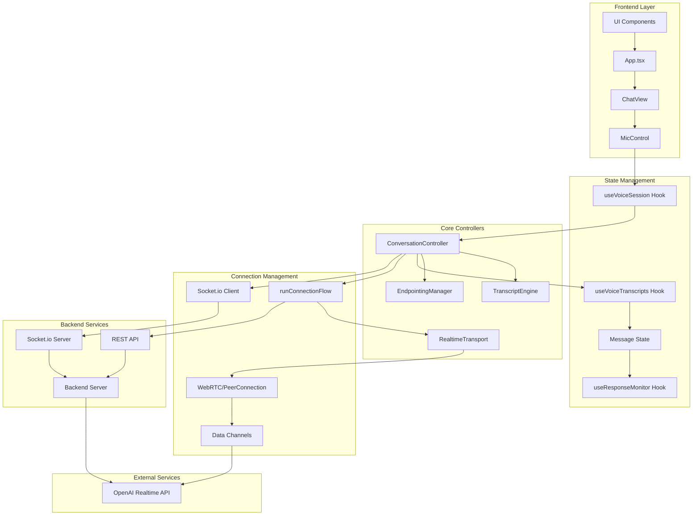
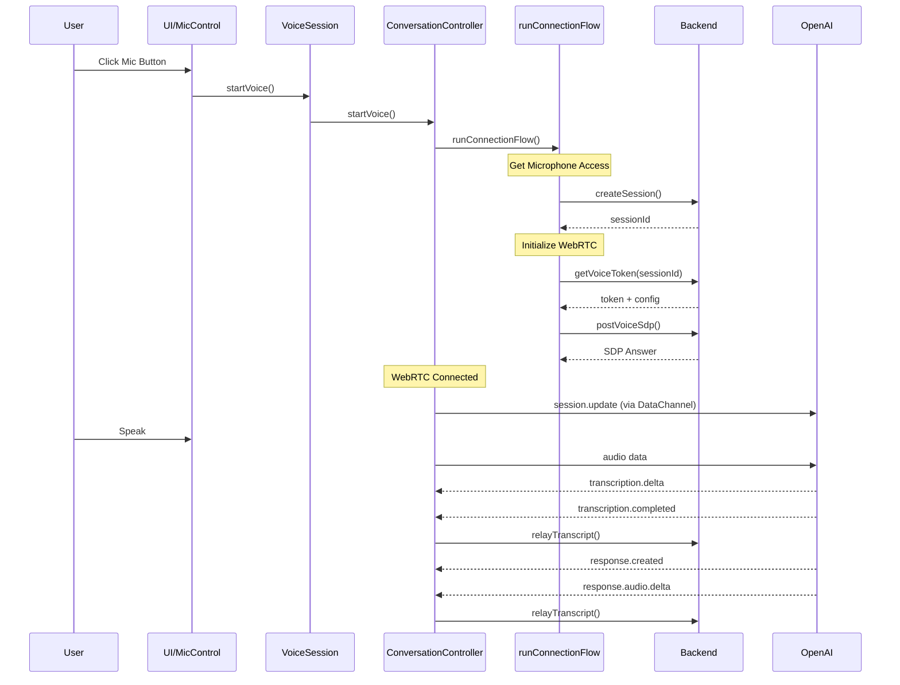
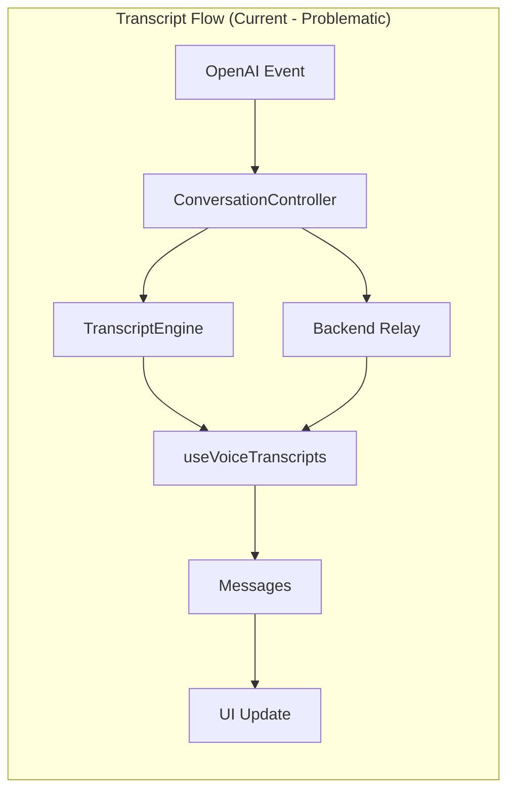

# Current Voice/Realtime System Architecture

## System Overview

## Current Event Flow

## Problems in Current Architecture

### 1. Session Management Chaos

- **Multiple Session IDs**: 
  - Frontend session (created in App.tsx)
  - Backend session (created via API)
  - OpenAI session (via WebRTC)
  - External session (from URL/props)
- **Race Conditions**: Session used before fully initialized
- **No Single Source of Truth**: Each layer maintains its own session state

### 2. Event System Fragmentation

- **Multiple Event Sources**:
  - OpenAI events via DataChannel
  - Socket.io events from backend
  - Internal events in ConversationController
  - UI events from hooks
- **No Unified Event Bus**: Events handled differently in each layer
- **Duplicate Event Handling**: Same events processed multiple times

### 3. Transcript Processing Complexity

- **Multiple Processing Paths**:
  - Direct from OpenAI → TranscriptEngine
  - Backend relay path
  - UI update path via hooks
- **Duplicate Detection Scattered**: 
  - In TranscriptEngine
  - In useVoiceTranscripts
  - In message persistence
- **Race Conditions**: Finals arriving before partials, duplicates from multiple paths

### 4. Connection Management Issues

- **Retry Logic Duplication**:
  - In runConnectionFlow
  - In ConversationController
  - In API calls
- **State Synchronization**: Connection state not properly synchronized between layers
- **Resource Cleanup**: Unclear ownership of resources

### 5. Monolithic ConversationController

Currently handling:

- WebRTC connection management
- Session management
- Event processing from OpenAI
- Transcript management
- Audio streaming
- Socket.io communication
- Error handling
- State management

## Data Flow Issues

### Problems:

1. Multiple paths to the same destination
2. Race conditions between paths
3. Duplicate messages from different sources
4. No clear authority on message finalization

## Key Issues Summary

1. **"Hi." Response Loop**: AI gets confused state and reverts to greeting
2. **Session Race Conditions**: Frontend tries to use sessions before backend is ready
3. **Duplicate Transcripts**: Same transcript processed multiple times through different paths
4. **Memory Leaks**: Event listeners and resources not properly cleaned up
5. **Error Recovery Conflicts**: Multiple retry mechanisms that can conflict
6. **State Ambiguity**: No clear state machine for connection/conversation lifecycle
