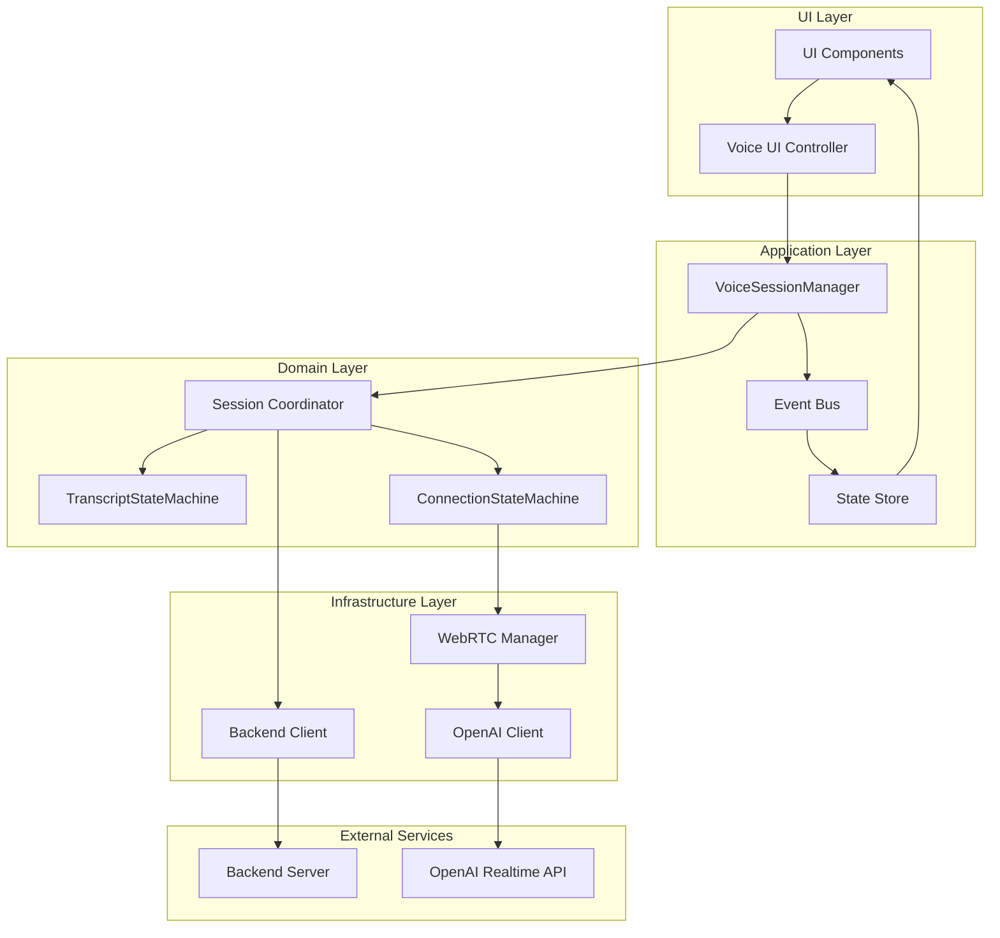
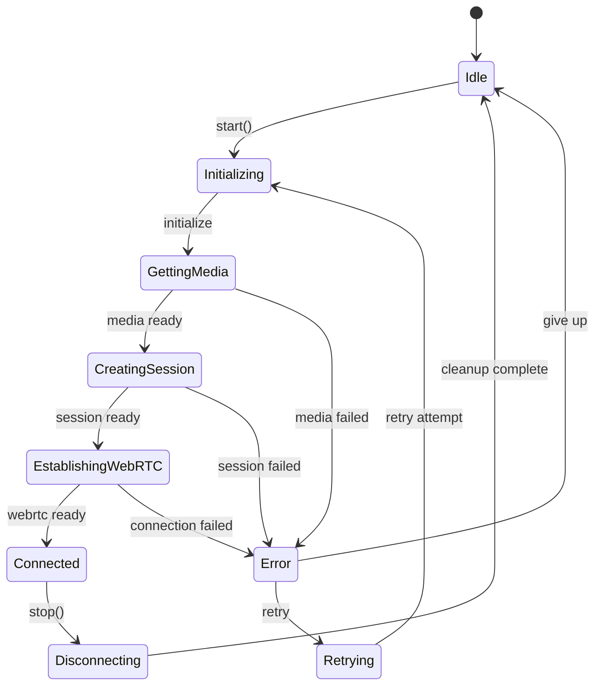
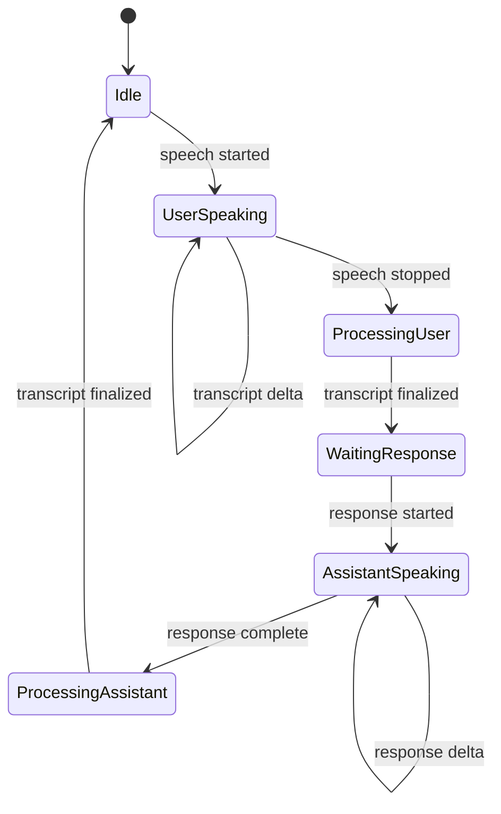
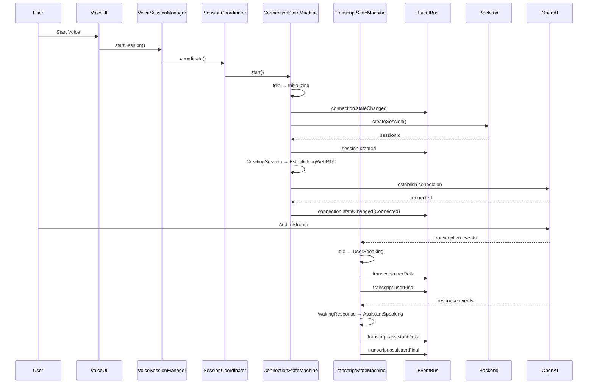

# Proposed Clean Architecture for Voice/Realtime System

## Design Principles

1. **Single Responsibility**: Each module has one clear purpose
2. **Clear State Machine**: Explicit states and transitions
3. **Unified Event Bus**: Single event system with typed events
4. **Single Source of Truth**: One authoritative state store
5. **Clean Separation**: Clear boundaries between layers

## Proposed Architecture



## Clean State Machines

### Connection State Machine



### Transcript State Machine



## Unified Event System

```typescript
// Event Types
type VoiceEvent = 
  | { type: 'session.created', sessionId: string }
  | { type: 'session.ready', sessionId: string }
  | { type: 'connection.stateChanged', state: ConnectionState }
  | { type: 'transcript.userDelta', text: string }
  | { type: 'transcript.userFinal', text: string }
  | { type: 'transcript.assistantDelta', text: string }
  | { type: 'transcript.assistantFinal', text: string }
  | { type: 'error', error: Error, recoverable: boolean }
```

## Clean Event Flow



## Implementation Modules

### 1. VoiceSessionManager

**Responsibility**: High-level session orchestration
```typescript
class VoiceSessionManager {
  constructor(
    private eventBus: EventBus,
    private sessionCoordinator: SessionCoordinator
  ) {}
  
  async startSession(config: SessionConfig): Promise<void>
  async stopSession(): Promise<void>
  getState(): SessionState
}
```

### 2. SessionCoordinator

**Responsibility**: Coordinate between different state machines
```typescript
class SessionCoordinator {
  constructor(
    private connectionSM: ConnectionStateMachine,
    private transcriptSM: TranscriptStateMachine,
    private backendClient: BackendClient
  ) {}
  
  async initialize(sessionId: string): Promise<void>
  async cleanup(): Promise<void>
}
```

### 3. ConnectionStateMachine

**Responsibility**: Manage connection lifecycle
```typescript
class ConnectionStateMachine {
  private state: ConnectionState
  
  async transition(event: ConnectionEvent): Promise<void>
  getState(): ConnectionState
  canTransition(to: ConnectionState): boolean
}
```

### 4. TranscriptStateMachine

**Responsibility**: Manage transcript flow and deduplication
```typescript
class TranscriptStateMachine {
  private state: TranscriptState
  private deduplicator: TranscriptDeduplicator
  
  async processEvent(event: TranscriptEvent): Promise<void>
  getState(): TranscriptState
}
```

### 5. EventBus

**Responsibility**: Central event distribution
```typescript
class EventBus {
  private subscribers: Map<string, Set<Handler>>
  
  emit(event: VoiceEvent): void
  subscribe(type: string, handler: Handler): Unsubscribe
  clear(): void
}
```

## Migration Strategy

### Phase 1: Preparation (Week 1)

1. Create new module structure alongside existing code
2. Implement EventBus
3. Implement State Machines
4. Write comprehensive tests

### Phase 2: Gradual Migration (Week 2-3)

1. **Day 1-2**: Migrate session management to SessionCoordinator
2. **Day 3-4**: Replace event handling with EventBus
3. **Day 5-6**: Migrate connection flow to ConnectionStateMachine
4. **Day 7-8**: Migrate transcript processing to TranscriptStateMachine
5. **Day 9-10**: Update UI to use new VoiceSessionManager

### Phase 3: Cleanup (Week 4)

1. Remove old ConversationController
2. Remove duplicate retry logic
3. Consolidate duplicate detection
4. Remove unused code
5. Update documentation

### Phase 4: Testing & Refinement (Week 5)

1. Comprehensive integration testing
2. Performance testing
3. Error recovery testing
4. User acceptance testing

## Benefits of New Architecture

1. **Clear Separation of Concerns**: Each module has a single, well-defined responsibility
2. **Predictable State Management**: Explicit state machines eliminate ambiguity
3. **Unified Event System**: Single event bus prevents duplicate processing
4. **Better Error Recovery**: Centralized error handling with clear recovery paths
5. **Easier Testing**: Each module can be tested in isolation
6. **Better Debugging**: Clear event flow and state transitions
7. **Reduced Complexity**: Simpler, more maintainable codebase

## Key Improvements

### Before

- Multiple session types managed independently
- Events processed in multiple places
- Duplicate detection scattered
- Unclear state transitions
- Monolithic controller

### After

- Single session coordinator
- Unified event bus
- Centralized deduplication
- Explicit state machines
- Modular architecture

## Immediate Benefits for Current Issues

1. **"Hi." Response Loop Fix**: Clear state machine prevents confused AI state
2. **Session Race Condition Fix**: SessionCoordinator ensures proper initialization order
3. **Duplicate Transcript Fix**: Single processing path with centralized deduplication
4. **Memory Leak Fix**: Clear resource ownership and cleanup in state transitions
5. **Error Recovery Fix**: Single, coordinated recovery mechanism in ConnectionStateMachine
